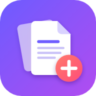

# PDF Atelier

**PDFs zusammenführen, Seiten auswählen und durchsuchen, als App für Windows und Smartphone.**
Zweisprachig (Deutsch / Français), mit Login, Tutorial und Texterkennung. Komplett kostenlos auf Firebase.

<p align="center"></p>

## Funktionen

| | |
|---|---|
| 📤 **Hochladen** | Mehrere PDFs auf einmal, per Button oder Drag & Drop. Unter Windows auch per „Öffnen mit → PDF Atelier“. |
| 🗂️ **Liste oder Vorschau** | Kompakte Dateiliste (aufklappbar bis auf Seitenebene) oder Vorschaubilder jeder Seite |
| 🔍 **Suche in allen Seiten** | Die App liest den Text jeder Seite und erkennt die **Überschrift**. Suchst du z. B. „Auto“ und drückst Enter, werden die Seiten mit dieser Überschrift **automatisch ausgewählt und groß angezeigt**, der Suchbegriff wird markiert. Groß-/Kleinschreibung und Akzente spielen keine Rolle („ecole“ findet „École“, „strasse“ findet „Straße“). |
| 🔠 **Texterkennung (OCR)** | Eingescannte Seiten ohne Text werden auf Knopfdruck durchsuchbar (Deutsch + Französisch). Das läuft direkt im Browser. |
| ✅ **Auswählen & sortieren** | Einzelne Seiten oder ganze Dateien auswählen, per Drag & Drop sortieren und drehen |
| 📎 **Exportieren** | Auswahl als **eine** PDF herunterladen oder (am Smartphone) direkt teilen |
| 🔄 **Umwandeln** | Eigener Reiter: PDF ↔ Word (DOCX), PDF → PowerPoint/PNG/JPG/TXT/Markdown/HTML, Excel ↔ CSV, Excel/CSV/TXT/Markdown/HTML → PDF oder Word, Bilder (PNG/JPG/WEBP/GIF/BMP) → PDF oder anderes Bildformat. Beim Exportieren der Auswahl lässt sich der Dateityp per Dropdown wählen. Alles läuft im Browser. |
| 🌍 **DE / FR** | Dropdown oben rechts: Die ganze App wechselt die Sprache, auch die E-Mails von Firebase |
| 🔐 **Konto** | Registrierung, Login, „Passwort vergessen“ (E-Mail), Bestätigungs-E-Mail |
| 🎓 **Tutorial** | Startet nach der Registrierung automatisch und lässt sich jederzeit über das Konto-Menü wiederholen |
| 📱 **Installierbar (PWA)** | Auf dem Windows-Desktop / im Startmenü und auf dem Home-Bildschirm (Android & iPhone), funktioniert auch offline |
| 🎨 **Design** | Animationen, Hell-/Dunkel-Modus (automatisch), für Smartphone und Desktop optimiert |

## Warum ist das kostenlos?

Die App nutzt nur Firebase-Dienste, die im kostenlosen **Spark-Tarif** enthalten sind:

| Dienst | Wofür | Kostenloses Kontingent (Spark) |
|---|---|---|
| Firebase **Authentication** | E-Mail/Passwort-Login, Passwort-Reset | E-Mail-Login ist kostenlos |
| **Cloud Firestore** | Profil: Sprache, Tutorial gesehen | 1 GiB Speicher, 50.000 Lesevorgänge/Tag |
| Firebase **Hosting** | Die App selbst (HTTPS, eigene Adresse `*.web.app`) | 10 GB Speicher, 360 MB Transfer/Tag |

**Die PDFs werden nicht in die Cloud hochgeladen.** Sie werden direkt im Browser verarbeitet
(pdf.js, pdf-lib, Tesseract.js) und lokal auf dem Gerät gespeichert (IndexedDB). Grund dafür:
*Cloud Storage für Firebase* braucht seit Februar 2026 den Blaze-Tarif mit hinterlegter
Zahlungsmethode. So bleibt die App garantiert kostenlos, schnell und privat.

> Im Spark-Tarif ist keine Zahlungsmethode hinterlegt. Wird ein Kontingent überschritten, pausiert
> der Dienst bis zum nächsten Tag. **Es können keine Kosten entstehen.**

Hinweis: Weil die Dateien auf dem Gerät bleiben, siehst du PDFs, die du am Handy hochlädst, nicht
automatisch am PC (und umgekehrt). Konto, Sprache und Tutorial-Status werden aber synchronisiert.

---

## Schnellstart (lokal ausprobieren)

Voraussetzung: [Node.js](https://nodejs.org) ab Version 22.

```bash
npm install
npm run dev
```

Dann <http://localhost:5173> öffnen. Ohne Firebase-Konfiguration startet die App im
**Demo-Modus**: Konten werden nur lokal im Browser gespeichert, du kannst aber alles testen.

## Firebase einrichten (einmalig, ca. 10 Minuten)

1. **Projekt anlegen:** <https://console.firebase.google.com> → „Projekt hinzufügen“.
   Google Analytics wird nicht benötigt. Das Projekt bleibt im kostenlosen Spark-Tarif.
2. **Login aktivieren:** *Build → Authentication → Jetzt starten → Anmeldemethode →
   E-Mail-Adresse/Passwort → Aktivieren → Speichern.*
3. **Datenbank anlegen:** *Build → Firestore Database → Datenbank erstellen.* Standort z. B.
   `eur3 (Europe)` oder `europe-west3 (Frankfurt)` wählen, Modus „Produktion“.
   (Die Sicherheitsregeln aus `firestore.rules` werden beim Veröffentlichen hochgeladen.)
4. **Web-App registrieren:** *Projekteinstellungen (Zahnrad) → Allgemein → Meine Apps → `</>` (Web)*.
   Einen Namen vergeben; „Firebase Hosting“ muss nicht angehakt werden.
   Die angezeigte `firebaseConfig` brauchst du nur für die **lokale** Entwicklung: Werte in
   `src/config/firebase-config.js` eintragen oder `.env.example` nach `.env.local` kopieren und
   ausfüllen. Auf Firebase Hosting lädt die App die Konfiguration **automatisch**.
5. **Firebase-CLI installieren und anmelden:**
   ```bash
   npm install -g firebase-tools
   firebase login
   ```
6. **Projekt verknüpfen:** In `.firebaserc` `DEINE-FIREBASE-PROJEKT-ID` durch deine Projekt-ID
   ersetzen (steht in den Projekteinstellungen) oder `firebase use --add` ausführen.
7. **Veröffentlichen:**
   ```bash
   npm run deploy
   ```
   Danach ist die App unter `https://<projekt-id>.web.app` erreichbar.

Optional:
- *Authentication → Vorlagen*: Absendername und Text der E-Mails anpassen. Die Sprache (DE/FR)
  setzt die App automatisch passend zur gewählten Sprache.
- Eigene Domain: *Hosting → Benutzerdefinierte Domain hinzufügen* (kostenlos, inkl. SSL), die Domain
  danach unter *Authentication → Einstellungen → Autorisierte Domains* eintragen.

## Als App installieren

- **Windows:** Seite in Microsoft Edge oder Google Chrome öffnen → in der Adressleiste auf
  „App installieren“ klicken (oder in der App: Konto-Menü → „Als App installieren“).
  Die App erscheint im Startmenü und auf Wunsch auf dem Desktop. PDFs lassen sich dann per
  Rechtsklick → „Öffnen mit“ → *PDF Atelier* öffnen.
- **Android:** In Chrome auf „App installieren“ tippen (oder Menü ⋮ → „Zum Startbildschirm hinzufügen“).
- **iPhone/iPad:** In Safari auf „Teilen“ → „Zum Home-Bildschirm“.

## Windows-Programm (.exe) zum Herunterladen

Auf der Website gibt es oben rechts den Reiter **„Download“**. Dort bekommt man
`PDF-Atelier-Setup.exe` (Windows 10/11, Verknüpfung auf Desktop und im Startmenü) sowie die
Anleitung für Smartphones.

Die `.exe` ist ein schlankes Programmfenster ([Electron](https://www.electronjs.org), Ordner
`desktop/`), das deine Web-App lädt. **Jede Änderung an der Website ist dadurch sofort auch in
der Windows-App aktiv**, du musst die `.exe` nur neu bauen, wenn sich Icon/Name ändern.

Gebaut wird sie kostenlos von **GitHub Actions** (`.github/workflows/windows-app.yml`):

1. **Adresse der Web-App hinterlegen:** GitHub → Repository → *Settings → Secrets and variables →
   Actions → Reiter „Variables“ → New repository variable*: Name `APP_URL`, Wert z. B.
   `https://DEINE-ADRESSE.vercel.app`.
2. **Bauen:** *Actions → „Windows-App bauen“ → Run workflow.* Nach ca. 5 Minuten liegt die Datei
   unter *Releases*.
3. **Download-Link:** Die Website verlinkt automatisch auf
   `https://github.com/IbrahimOE/PDF/releases/latest/download/PDF-Atelier-Setup.exe`.
   Andere Adresse? In Vercel die Umgebungsvariable `VITE_DESKTOP_DOWNLOAD_URL` setzen.

> **Wichtig:** Downloads aus Releases sind nur öffentlich erreichbar, wenn das Repository
> **öffentlich** ist. Soll der Code privat bleiben, lege ein zweites, öffentliches Repository
> (z. B. `PDF-Atelier-Download`) an und hinterlege im privaten Repository die Variable
> `RELEASE_REPO` = `IbrahimOE/PDF-Atelier-Download` und das Secret `RELEASE_TOKEN` (ein
> GitHub-Token mit Schreibrecht „Contents“ auf dieses Repository). Dann `VITE_DESKTOP_DOWNLOAD_URL`
> in Vercel auf `https://github.com/IbrahimOE/PDF-Atelier-Download/releases/latest/download/PDF-Atelier-Setup.exe` setzen.

> **Windows-SmartScreen:** Die `.exe` ist nicht digital signiert (ein Zertifikat kostet Geld).
> Beim ersten Start kann Windows „Der Computer wurde durch Windows geschützt“ anzeigen →
> „Weitere Informationen“ → „Trotzdem ausführen“. Darauf weist auch die Download-Seite hin.

## Entwicklung

```bash
npm run dev       # Entwicklungsserver
npm run build     # Produktions-Build nach dist/
npm run preview   # Build lokal ansehen
npm run deploy    # Build + Veröffentlichen auf Firebase Hosting
```

**Mit Firebase-Emulatoren testen** (echtes Auth/Firestore inkl. Sicherheitsregeln, ohne Cloud):

```bash
firebase emulators:start --only auth,firestore --project demo-pdf-atelier
VITE_FIREBASE_EMULATORS=true VITE_FIREBASE_API_KEY=demo VITE_FIREBASE_PROJECT_ID=demo-pdf-atelier \
  VITE_FIREBASE_AUTH_DOMAIN=localhost npm run dev
```

**App-Icon ändern:** `public/icons/icon.svg` und `public/icons/maskable.svg` bearbeiten, dann
`npm i -D playwright && npm run icons` (erzeugt alle PNG-Größen).

### Projektstruktur

```
src/
  main.js                 Start: Anmeldung ↔ App, Tutorial beim ersten Login
  actions.js / state.js   App-Logik und Zustand (Bibliothek, Auswahl, Suche, OCR)
  i18n/                   Übersetzungen de.js / fr.js
  services/
    backend*.js           Firebase (Auth + Firestore) bzw. lokaler Demo-Modus
    db.js                 Lokaler PDF-Speicher (IndexedDB)
    pdf.js                pdf.js: Text, Überschriften, Vorschaubilder
    search.js             Volltextsuche (akzent-/umlaut-tolerant)
    merge.js              pdf-lib: Export und Beispiel-PDF
    ocr.js                Tesseract.js-Texterkennung (selbst gehostet)
  ui/                     Oberfläche: Anmeldung, Bibliothek, Auswahl, Vorschau, Tutorial, Installation
  styles/main.css         Design-System, Animationen, Hell/Dunkel
public/icons/             App-Icon (SVG + PNG)
scripts/                  Kopiert pdf.js-/OCR-Dateien, erzeugt Icons
desktop/                  Windows-App (Electron) → PDF-Atelier-Setup.exe
firestore.rules           Jede Person sieht nur ihr eigenes Profil
```

Verwendete Open-Source-Bibliotheken: [pdf.js](https://mozilla.github.io/pdf.js/) (Apache-2.0),
[pdf-lib](https://pdf-lib.js.org) (MIT), [Tesseract.js](https://tesseract.projectnaptha.com) (Apache-2.0),
[SortableJS](https://sortablejs.github.io/Sortable/) (MIT), [Lucide](https://lucide.dev) (ISC),
[Inter](https://rsms.me/inter/) (OFL), [vite-plugin-pwa](https://vite-pwa-org.netlify.app) (MIT).
